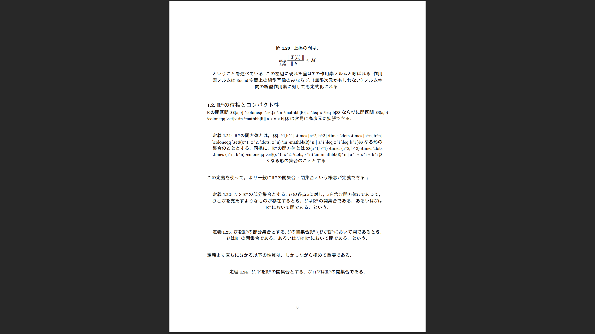

# LaTeX から typst に移行したときのメモ

## 移行対象

https://github.com/xenolay/calculus_on_manifolds

- だいたい4000行くらいの `.tex` ファイル群
- ふつうの数学のノート

## 下準備

- typst のコードをある程度弄る必要があるので執筆環境はあったほうがいい。
  - typst cli がほしければ cargo install で一発
    - https://github.com/typst/typst?tab=readme-ov-file#installation にあるように `cargo install --locked typst-cli` すればいい
  - VSC の拡張機能 tinymist typst がある。
    - https://github.com/Myriad-Dreamin/tinymist
    - preview 機能があり、ホットリロードしてくれる。便利。
      - LaTeX にもホットリロードしてくれるような仕組みはなにかしらあるとは思う。私が LaTeX を使ってた頃は TeXShop とかいうメモ帳を使っていて、毎回手動でコンパイルしていたのでよくわかんないんですが……
    - 

## とりあえず `.typ` ファイルをコンパイルするところまで

- とりあえず pandoc を使って latex のコードを typst に無理くり変換する
  - pandoc は https://github.com/jgm/pandoc/blob/main/INSTALL.md にやりかたがのってる


```bash
# 変換下ごしらえ（叩き台用ディレクトリ）
mkdir -p draft
cd draft
# ルート＆分割ファイルを個別に .typ に変換（失敗しても続行）
pandoc -f latex -t typst -s Calculus_on_Manifolds.tex \
  --resource-path=. -o draft/main.typ
```

こうやってみたところ main.typ に4000行くらいの typ ファイルが生成された。

もともとの Calculus_on_Manifolds.tex は以下のような感じで section 単位で tex ファイルを分割していたのだが、どうも pandoc は include 文の内容をベタに展開して変換する様子。

```tex
\documentclass[uplatex,11pt,a4]{jsarticle}

\include{./preamble.tex}

\begin{document}
\title{多変数の解析学}
\author{}
\date{}
\maketitle

\newpage

\include{./preface.tex}

\include{./acknowledgement.tex}

\newpage

\tableofcontents

\newpage

\include{./section1.tex}

\newpage

\include{./section2.tex}

\newpage

\include{./section3.tex}

\newpage

\include{./section4.tex}

\newpage

\include{./section5.tex}

\newpage

\include{./section6.tex}

\end{document}
```

当然ながらそのままだとあちこちメチャクチャになっており、動かない。ので、LaTeX の section 単位で分割して移行する方針にする。

とりあえず、本文をすべてコメントアウトしてコンパイルが通ることを確認する。

```
typst compile draft/main.typ draft/out.pdf
```

できた。

```
for f in section{1..6}.tex; do  pandoc -f latex -t typst -s "$f" -L thm2typst.lua -o "draft/${f%.tex}.typ" || true; done
```

## pandoc が変換してくれなかったと明示的に申告してきたもの

この時点で pandoc が出した警告も確認しておくと、以下のようなものがたくさんでていた。

```
  unexpected control sequence \set
  expecting "%", "\\label", "\\tag", "\\nonumber", whitespace or "\\allowbreak"
[WARNING] Could not convert TeX math \set{x}, rendering as TeX:
  \set{x}
      ^
```

記憶が正しければ私は braket パッケージで宣言されている `\set` コマンドを使って集合を書いていたはず。 https://www.ctan.org/pkg/braket
さすがに外部パッケージのコマンドまでいい感じに解決はしてくれないか。

## pandoc 任せで全部うまく行ったもの

逆に、自分が定義した preamble であればある程度は pandoc で勝手に解決してくれるように見える。私はあんまり凝ったことを preamble でやっていなかったので苦労せずに済んだのかも。

TeX 側で

```tex
\newcommand{\Real}{\mathbb{R}}
```

のように定義したうえで

```tex
特に，$M$として$\Real$の閉区間$[a,b]$，$\omega$として$[a,b]$上の0-形式（すなわち$C^\infty$級関数）$F$を取り，$F$の導関数を$f$と書くことにすれば，...
```

と書いていたものが、pandoc に通した段階で

```typ
特に，$M$として$bb(R)$の閉区間$\[ a \, b \]$，$omega$として$\[ a \, b \]$上の0-形式（すなわち$C^oo$級関数）$F$を取り，$F$の導関数を$f$と書くことにすれば，...
```

のように翻訳されていた。LaTeX の preamble で勝手に定義した `\Real` が typst の `$bb(R)` に変換されていることに注意。

## pandoc 任せだとちっともうまく行ってる様子がないもの

- 定理番号
- ラベルとその参照
- フォントなどのスタイル調整

がかなりうまく行ってない様子。

latex 


typst


とりあえず定理番号がちゃんとついてフォントがマトモになればそれっぽさが増すと思うのでそこを修復する。

### 定理番号

#### うまく行ってない理由

- 定理環境を以下のように外部パッケージのコマンドを使って宣言していた
  - thmtools パッケージで宣言されている `\declaretheorem`  https://ctan.org/pkg/thmtools
  - amsthm パッケージで宣言されている `\newtheorem` https://ctan.org/pkg/amsthm

（他の人の LaTeX ソースコードをまじめに読んだことはないけど、定理環境の見た目をそれっぽくしたい人が外部パッケージを何の気なしにいれるというのは珍しくないようにも思う。昔の私とかまさにそれだったわけだし……）

```tex
% preamble の記述
\usepackage{thmtools}

\newtheoremstyle{mythm}% name
{10pt}% Space above
{15pt}% Space below
{\normalfont}% Body font
{}% Indent amount
{\bfseries}% Theorem head font
{.}% Punctuation after theorem head
{5pt plus 1pt minus 1pt}% Space after theorem head
{}% Theorem head spec (can be left empty, meaning ‘normal’)

% thm：定理番号を振る．
% thm*：定理番号を振らない．declaretheorem を使わない．

\theoremstyle{mythm}
\declaretheorem[name=定理,numberwithin=section]{thm}
\declaretheorem[name=定義,numberlike=thm]{defi}
\declaretheorem[name=補題,numberlike=thm]{lem}
\declaretheorem[name=問,numberlike=thm]{que}
\declaretheorem[name=系,numberlike=thm]{cor}
\declaretheorem[name=命題,numberlike=thm]{prop}
\declaretheorem[name=余談,numberlike=thm]{dig}
\declaretheorem[name=主張,numberlike=thm]{state}
\declaretheorem[name=例,numberlike=thm]{exm}
\declaretheorem[name=注意,numberlike=thm]{rem}
\newtheorem*{thm*}{定理}
\newtheorem*{lem*}{補題}
\newtheorem*{defi*}{定義}
\newtheorem*{exm*}{例}
\newtheorem*{cor*}{系}
\newtheorem*{que*}{問}
\newtheorem*{state*}{主張}
\newtheorem*{prop*}{命題}
```

```tex
% 実際の記述
\begin{defi}
$\Real$の$n$つ組からなる集合のことを$\Real^n$と書き，$n$次元 Euclid 空間と呼ぶ．すなわち$\Real^n$は，$n$個の実数$x^1, x^2, \dots, x^n$を用いて$(x^1, x^2, \dots, x^n)$と書かれるようなもの全体のことである．
$\Real^n$には次のような仕方で加法とスカラー倍が定まる；
\begin{align}
(x^1, x^2, \dots, x^n)+(y^1, y^2, \dots, y^n) &\coloneqq (x^1 + y^1, x^2 + y^2, \dots, x^n + y^n) \\
a \cdot (x^1, x^2, \dots, x^n) &\coloneqq (ax^1, ax^2, \dots, ax^n) 
\end{align}ただし，$a \in \Real$．
\end{defi}

通常$\Real^n$の元は（行列の計算との都合上）$x^i$たちを縦に並べたものとすることが多い（すなわち$n \times 1$行列と同一視することが多い）が，縦ベクトルは紙幅を取るし，かといって逐一転置${}^\top$を書くのも煩雑なので，文脈から分かる場合および縦横の差異が問題にならない場合は横に並べて書いた上で転置の記号を省略する．以下，$x \in \Real^n$に対して，その第$i$成分を$x^i$と表すことにする．

\begin{dig}
ベクトルを細字で書いている理由はなんとなくシンプルでかっこよいのと， \LaTeX で書く量が減るからである．数学の風習に合わせているというタテマエをつけられなくもないが，あくまでタテマエの域を出ない．
\end{dig}
```

これが pandoc を通した結果、ぜんぶ block に書き換わっている。定理も定義も補題も全部 `#block` に潰れてしまっている。

```typ
#block[
  $bb(R)$の$n$つ組からなる集合のことを$bb(R)^n$と書き，$n$次元 Euclid
  空間と呼ぶ．すなわち$bb(R)^n$は，$n$個の実数$x^1 \, x^2 \, dots.h \, x^n$を用いて$\( x^1 \, x^2 \, dots.h \, x^n \)$と書かれるようなもの全体のことである．
  $bb(R)^n$には次のような仕方で加法とスカラー倍が定まる；
  $ \( x^1 \, x^2 \, dots.h \, x^n \) + \( y^1 \, y^2 \, dots.h \, y^n \) & colon.eq \( x^1 + y^1 \, x^2 + y^2 \, dots.h \, x^n + y^n \)\
  a dot.op \( x^1 \, x^2 \, dots.h \, x^n \) & colon.eq \( a x^1 \, a x^2 \, dots.h \, a x^n \) $ただし，$a in bb(R)$．

]
通常$bb(R)^n$の元は（行列の計算との都合上）$x^i$たちを縦に並べたものとすることが多い（すなわち$n times 1$行列と同一視することが多い）が，縦ベクトルは紙幅を取るし，かといって逐一転置$zws^top$を書くのも煩雑なので，文脈から分かる場合および縦横の差異が問題にならない場合は横に並べて書いた上で転置の記号を省略する．以下，$x in bb(R)^n$に対して，その第$i$成分を$x^i$と表すことにする．

#block[
  ベクトルを細字で書いている理由はなんとなくシンプルでかっこよいのと，
  LaTeXで書く量が減るからである．数学の風習に合わせているというタテマエをつけられなくもないが，あくまでタテマエの域を出ない．

]
```

ということは、
- pandoc 側で区別をつけて変換できるようにするか
- pandoc を通したあとの `.typ` を温かみのある手作業で編集するか

のどちらかだが……さすがに後者をやるのは嫌なのでもう少し逃げ道を考える。

#### 修復まで

ちょい調べたところ、pandoc は input を AST に変換してその AST をもとに対象の言語へのアウトプットを吐くらしい。で、その AST に対して特定の規則で変換をかけることができる。この変換のことを filter というらしい。

[] Pandoc - Pandoc filters
https://pandoc.org/filters.html
```
A “filter” is a program that modifies the AST, between the reader and the writer.

INPUT --reader--> AST --filter--> AST --writer--> OUTPUT
```

ということは pandoc の AST について調べて filter をかけばよさそうな感じに見える。公式ドキュメント曰くは Lua filter と JSON filter の2つがあり、Lua filter がおすすめらしいので Lua filter を頑張って書いてみよう。

とはいえ自分が相手にしている AST の様子がまったくわからないと手を出しにくいので、小さなサイズでとりあえずナマの AST を出力させてみることにする。

```latex
\begin{dig}
ベクトルを細字で書いている理由はなんとなくシンプルでかっこよいのと， \LaTeX で書く量が減るからである．数学の風習に合わせているというタテマエをつけられなくもないが，あくまでタテマエの域を出ない．
\end{dig}
```

これを json format ならびに haskell native format で出力させてみた結果がこちら

```
{
  "t": "Div",
  "c": [
    ["", ["dig"], []],   // Attr: id="", classes=["dig"], attrs=[]
    [                    // 中身([Block])
      { "t": "Para",
        "c": [
          { "t": "Str", "c": "ベクトルを細字で書いている理由はなんとなくシンプルでかっこよいのと，" },
          { "t": "Space" },
          { "t": "Str", "c": "LaTeXで書く量が減るからである．数学の風習に合わせているというタテマエをつけられなくもないが，あくまでタテマエの域を出ない．" }
        ]
      }
    ]
  ]
}
```

```
Div
    ( "" , [ "dig" ] , [] )
    [ Para
        [ Str
            "\12505\12463\12488\12523\12434\32048\23383\12391\26360\12356\12390\12356\12427\29702\30001\12399\12394\12435\12392\12394\12367\12471\12531\12503\12523\12391\12363\12387\12371\12424\12356\12398\12392\65292"
        , Space
        , Str
            "LaTeX\12391\26360\12367\37327\12364\28187\12427\12363\12425\12391\12354\12427\65294\25968\23398\12398\39080\32722\12395\21512\12431\12379\12390\12356\12427\12392\12356\12358\12479\12486\12510\12456\12434\12388\12369\12425\12428\12394\12367\12418\12394\12356\12364\65292\12354\12367\12414\12391\12479\12486\12510\12456\12398\22495\12434\20986\12394\12356\65294"
        ]
    ]
```

よくわからないので更に調べてみた感じ、（Haskell で定義されている）Div というコンストラクタがあって、そいつの引数が Attr と Block のリストだということらしい。

[] Block | 
https://hackage.haskell.org/package/pandoc-types-1.23.1/docs/src/Text.Pandoc.Definition.html#Block
```hs
-- | Block element.
data Block
    -- | Plain text, not a paragraph
    = Plain [Inline]
    -- | Paragraph
    | Para [Inline]
    -- | Multiple non-breaking lines
    | LineBlock [[Inline]]
    -- | Code block (literal) with attributes
    | CodeBlock Attr Text
    -- | Raw block
    | RawBlock Format Text
    -- | Block quote (list of blocks)
    | BlockQuote [Block]
    -- | Ordered list (attributes and a list of items, each a list of
    -- blocks)
    | OrderedList ListAttributes [[Block]]
    -- | Bullet list (list of items, each a list of blocks)
    | BulletList [[Block]]
    -- | Definition list. Each list item is a pair consisting of a
    -- term (a list of inlines) and one or more definitions (each a
    -- list of blocks)
    | DefinitionList [([Inline],[[Block]])]
    -- | Header - level (integer) and text (inlines)
    | Header Int Attr [Inline]
    -- | Horizontal rule
    | HorizontalRule
    -- | Table, with attributes, caption, optional short caption,
    -- column alignments and widths (required), table head, table
    -- bodies, and table foot
    | Table Attr Caption [ColSpec] TableHead [TableBody] TableFoot
    -- | Figure, with attributes, caption, and content (list of blocks)
    | Figure Attr Caption [Block]
    -- | Generic block container with attributes
    | Div Attr [Block]
    deriving (Eq, Ord, Read, Show, Typeable, Data, Generic)
```

[] Attr | 
https://hackage.haskell.org/package/pandoc-types-1.23.1/docs/src/Text.Pandoc.Definition.html#Attr
```
-- | Attributes: identifier, classes, key-value pairs
type Attr = (Text, [Text], [(Text, Text)])
```

まあつまりは AST 上で Div というやつを見かけたらそいつの class を確認して、defi や lem などが入り込んでいたらそれに応じて内容を block ではない別の要素で包み直すということをすれば動きそうである。

実際に不明な定理環境を見かけたときに block に落とし込むかどうかは実装を見ればわかりそうだが、一旦はそこまではしない。

ちなみに typst に組み込みで定理環境があるのかというとなさそうで、調べる限りだと typst-theorems という外部パッケージを利用する方針になりそう。

https://github.com/sahasatvik/typst-theorems

で、pandoc の AST に変換する時点でこのパッケージのことは知る由もないはずなので、 typst 向けの preamble を別途手書きする方針で行く。そんなに数は多くないので大変じゃないと思う。

当然 Lua の書き方なんてよく知らないので ChatGPT 5 Thinking に Lua filter を書かせて少し手直ししたものがこちら。

```lua
-- thm2typst.lua
local map = {
  thm="thm",
  defi="defi",
  lem="lem",
  que="que",
  cor="cor",
  prop="prop",
  dig="dig",
  state="state",
  exm="exm",
  rem="rem"
}

local function env_of(classes)
  for _,c in ipairs(classes or {}) do
    if map[c] then return map[c], c end
  end
end

local function esc(s) return s and (s:gsub("\\","\\\\"):gsub('"','\\"')) or s end

function Div(el)
  local typ = env_of(el.classes)
  if not typ then return nil end

  local title, body = peel_header(el.content)
  local open
  if title then
    open = string.format('#%s("%s")[', typ, esc(title))
  else
    open = string.format('#%s[', typ)
  end

  local out = { pandoc.RawBlock("typst", open) }
  for _,b in ipairs(body) do table.insert(out, b) end
  table.insert(out, pandoc.RawBlock("typst", "]"))
  return out
end
```

`peel_header` が明らかに不要ないし不適切な処理をしているのが透けて見えるが、とりあえず最低限の動作をするかどうかはこの時点で見ておこう。

動作確認のために以下を `debug.tex` として保存して、

```tex
\newcommand{\Real}{\mathbb{R}}

\begin{defi}
$\Real$の$n$つ組からなる集合のことを$\Real^n$と書き，$n$次元 Euclid 空間と呼ぶ．すなわち$\Real^n$は，$n$個の実数$x^1, x^2, \dots, x^n$を用いて$(x^1, x^2, \dots, x^n)$と書かれるようなもの全体のことである．
$\Real^n$には次のような仕方で加法とスカラー倍が定まる；
\begin{align}
(x^1, x^2, \dots, x^n)+(y^1, y^2, \dots, y^n) &\coloneqq (x^1 + y^1, x^2 + y^2, \dots, x^n + y^n) \\
a \cdot (x^1, x^2, \dots, x^n) &\coloneqq (ax^1, ax^2, \dots, ax^n) 
\end{align}ただし，$a \in \Real$．
\end{defi}

通常$\Real^n$の元は（行列の計算との都合上）$x^i$たちを縦に並べたものとすることが多い（すなわち$n \times 1$行列と同一視することが多い）が，縦ベクトルは紙幅を取るし，かといって逐一転置${}^\top$を書くのも煩雑なので，文脈から分かる場合および縦横の差異が問題にならない場合は横に並べて書いた上で転置の記号を省略する．以下，$x \in \Real^n$に対して，その第$i$成分を$x^i$と表すことにする．

\begin{dig}
ベクトルを細字で書いている理由はなんとなくシンプルでかっこよいのと， \LaTeX で書く量が減るからである．数学の風習に合わせているというタテマエをつけられなくもないが，あくまでタテマエの域を出ない．
\end{dig}
```

動作確認。動いてそう。

```bash
$ pandoc -f latex -t typst -L thm2typst.lua debug.tex
#defi[
$bb(R)$の$n$つ組からなる集合のことを$bb(R)^n$と書き，$n$次元 Euclid
空間と呼ぶ．すなわち$bb(R)^n$は，$n$個の実数$x^1 \, x^2 \, dots.h \, x^n$を用いて$\( x^1 \, x^2 \, dots.h \, x^n \)$と書かれるようなもの全体のことである．
$bb(R)^n$には次のような仕方で加法とスカラー倍が定まる；
$ \( x^1 \, x^2 \, dots.h \, x^n \) + \( y^1 \, y^2 \, dots.h \, y^n \) & colon.eq \( x^1 + y^1 \, x^2 + y^2 \, dots.h \, x^n + y^n \)\
a dot.op \( x^1 \, x^2 \, dots.h \, x^n \) & colon.eq \( a x^1 \, a x^2 \, dots.h \, a x^n \) $ただし，$a in bb(R)$．

]
通常$bb(R)^n$の元は（行列の計算との都合上）$x^i$たちを縦に並べたものとすることが多い（すなわち$n times 1$行列と同一視することが多い）が，縦ベクトルは紙幅を取るし，かといって逐一転置$zws^top$を書くのも煩雑なので，文脈から分かる場合および縦横の差異が問題にならない場合は横に並べて書いた上で転置の記号を省略する．以下，$x in bb(R)^n$に対して，その第$i$成分を$x^i$と表すことにする．

#dig[
ベクトルを細字で書いている理由はなんとなくシンプルでかっこよいのと，
LaTeXで書く量が減るからである．数学の風習に合わせているというタテマエをつけられなくもないが，あくまでタテマエの域を出ない．

]
$
```

ということで、残るはこの `#defi` とかをちゃんと変数として定義してあげれば動きそう。

んで、
```
$ pandoc -f latex -t typst -s section1.tex -L thm2typst.lua --resource-path=. -o draft/chapter1.typ
```

したうえで

```typst
// main.typ
#import "@preview/ctheorems:1.1.3": *
#show: thmrules
#let defi = thmbox("定理", "定理")

#include "heading.typ"

#include "chapter1.typ"
```

みたいにやってみたのだが動かず。どうも include 元で定義していたとしても include される側単独で定義を解決できないと動かないという挙動に見える。

```
$ typst compile draft/main.typ draft/out.pdf
error: unknown variable: defi
  ┌─ draft/chapter1.typ:7:1
  │
7 │ #defi[
  │  ^^^^

help: error occurred while importing this module
    ┌─ draft/main.typ:138:9
    │
138 │ #include "chapter1.typ"
    │          ^^^^^^^^^^^^^^

$
```

公式ドキュメントの modules の項をみてもいまいちわからない。

[] Modules | Scripting – Typst Documentation
https://typst.app/docs/reference/scripting/#modules
```
Including: include "bar.typ"
Evaluates the file at the path bar.typ and returns the resulting content.

Import: import "bar.typ"
Evaluates the file at the path bar.typ and inserts the resulting module into the current scope as bar (filename without extension). You can use the as keyword to rename the imported module: import "bar.typ" as baz. You can import nested items using dot notation: import "bar.typ": baz.a.

Import items: import "bar.typ": a, b
Evaluates the file at the path bar.typ, extracts the values of the variables a and b (that need to be defined in bar.typ, e.g. through let bindings) and defines them in the current file. Replacing a, b with * loads all variables defined in a module. You can use the as keyword to rename the individual items: import "bar.typ": a as one, b as two
```

しょうがないので、preamble の内容を `preamble.typ` に分離して、各 section のファイルで `preamble.typ` を import する形にしてみたところ、ちゃんと動いた。
なお include だと同じエラーで動かない。

```typst
// main.typ
#include "heading.typ"

#include "section1.typ"
```

```typst
// preamble.typ
#import "@preview/ctheorems:1.1.3": *
#show: thmrules
#let thm = thmbox("theorem", "定理")
#let defi = thmbox("theorem", "定義")
#let lem = thmbox("theorem", "補題")
#let que = thmbox("theorem", "問")
#let cor = thmbox("theorem", "系")
#let prop = thmbox("theorem", "命題")
#let dig = thmbox("theorem", "余談")
#let state = thmbox("theorem", "主張")
#let exm = thmbox("theorem", "例")
#let rem = thmbox("theorem", "注意")
#let proof = thmproof("proof", "証明")

```

```typst
// 各セクションファイル。
#import "preamble.typ": * // なお import の代わりに include だと同じエラーで動かない。

= 準備
<準備>
多変数解析学を本格的に議論するにあたって必要な概念たちを手短に扱う．

== $bb(R)^n$の線型空間としての構造
<mathbbrnの線型空間としての構造>
#defi[
  $bb(R)$の$n$つ組からなる集合のことを$bb(R)^n$と書き，$n$次元 Euclid
  空間と呼ぶ．すなわち$bb(R)^n$は，$n$個の実数$x^1 \, x^2 \, dots.h \, x^n$を用いて$\( x^1 \, x^2 \, dots.h \, x^n \)$と書かれるようなもの全体のことである．
  $bb(R)^n$には次のような仕方で加法とスカラー倍が定まる；
  $ \( x^1 \, x^2 \, dots.h \, x^n \) + \( y^1 \, y^2 \, dots.h \, y^n \) & colon.eq \( x^1 + y^1 \, x^2 + y^2 \, dots.h \, x^n + y^n \)\
  a dot.op \( x^1 \, x^2 \, dots.h \, x^n \) & colon.eq \( a x^1 \, a x^2 \, dots.h \, a x^n \) $ただし，$a in bb(R)$．
```

動いた時の様子がこちら。番号はついている。


もともとの本では定理番号を section ごとに管理していたので、そうなるように直したい。これは ctheorems の manual に普通に書いてあって、base_level を指定すれば出来た。

```typst
// preamble.tex
#import "@preview/ctheorems:1.1.3": *
#let thm = thmbox("theorem", "定理", base_level: 1)
#let defi = thmbox("theorem", "定義", base_level: 1)
#let lem = thmbox("theorem", "補題", base_level: 1)
#let que = thmbox("theorem", "問", base_level: 1)
#let cor = thmbox("theorem", "系", base_level: 1)
#let prop = thmbox("theorem", "命題", base_level: 1)
#let dig = thmbox("theorem", "余談", base_level: 1)
#let state = thmbox("theorem", "主張", base_level: 1)
#let exm = thmbox("theorem", "例", base_level: 1)
#let rem = thmbox("theorem", "注意", base_level: 1)
#let proof = thmproof("proof", "証明", base_level: 1)
```

ちなみにここで `fill` を指定してあげれば色もつく（けど、下の画像では色がついていない）。



また、意図せず中央揃えになっているものは各セクションファイルで `#show: thmrules` を書いてあげないと直らない。マジかよー。
公式の forum でもそのように案内がされている。このへんはこなれていない印象がある。
https://forum.typst.app/t/how-do-i-align-text-in-ctheorems-thmbox/3273

```diff
// 各セクションファイル。
#import "preamble.typ": * // なお import の代わりに include だと同じエラーで動かない。
+ #show: thmrules
= 準備
<準備>
多変数解析学を本格的に議論するにあたって必要な概念たちを手短に扱う．

== $bb(R)^n$の線型空間としての構造
<mathbbrnの線型空間としての構造>
#defi[
  $bb(R)$の$n$つ組からなる集合のことを$bb(R)^n$と書き，$n$次元 Euclid
  空間と呼ぶ．すなわち$bb(R)^n$は，$n$個の実数$x^1 \, x^2 \, dots.h \, x^n$を用いて$\( x^1 \, x^2 \, dots.h \, x^n \)$と書かれるようなもの全体のことである．
  $bb(R)^n$には次のような仕方で加法とスカラー倍が定まる；
  $ \( x^1 \, x^2 \, dots.h \, x^n \) + \( y^1 \, y^2 \, dots.h \, y^n \) & colon.eq \( x^1 + y^1 \, x^2 + y^2 \, dots.h \, x^n + y^n \)\
  a dot.op \( x^1 \, x^2 \, dots.h \, x^n \) & colon.eq \( a x^1 \, a x^2 \, dots.h \, a x^n \) $ただし，$a in bb(R)$．
```

### ラベルとその参照

以下を `debug_label.tex` として保存して

```tex
\newcommand{\Real}{\mathbb{R}}


\begin{que}\label{線型写像と行列の対応}
$A$を$m \times n$行列とする時，$A$倍写像$\Real^n \ni x \mapsto Ax \in \Real^m$は線型写像である．逆に$T \colon \Real^n \to \Real^m$を線型写像とすると，ある行列$A$が存在して$T(x) = Ax$が成り立つ．
\end{que}

\begin{lem}\label{線型写像の連続性}
$T \colon \Real^m \to \Real^n$を線型写像とする．このとき，ある実数$M$があって，任意の$h \in V$に対して$\|T(h)\| \leq M \|h\|$が成り立つ．
\end{lem}

\begin{proof}
問 \ref{線型写像と行列の対応} の結果より，ある行列$A = \left(a^i_j\right)$があって$T(h) = Ah$であるとしてよい．$M \coloneqq \max \left\{\left|a^i_j\right|\right\} $とすればよい．
\end{proof}
```

pandoc にかけると以下のようになる。

```typst
$ pandoc -f latex -t typst -L thm2typst.lua debug_label.tex
#que[
<線型写像と行列の対応>
$A$を$m times n$行列とする時，$A$倍写像$bb(R)^n in.rev x mapsto A x in bb(R)^m$は線型写像である．逆に$T : bb(R)^n arrow.r bb(R)^m$を線型写像とすると，ある行列$A$が存在して$T \( x \) = A x$が成り立つ．

]

]
#proof[
#emph[Proof.] 問 @線型写像と行列の対応
の結果より，ある行列$A = (a_j^i)$があって$T \( h \) = A h$であるとしてよい．$M colon.eq max {lr(|a_j^i|)}$とすればよい．~◻

]
```

上掲したものは動作しない。label はこの位置ではなくて、block の直後に置かれてもらわないと困る。

```typst
#que[
  $A$を$m times n$行列とする時，$A$倍写像$bb(R)^n in.rev x mapsto A x in bb(R)^m$は線型写像である．逆に$T : bb(R)^n arrow.r bb(R)^m$を線型写像とすると，ある行列$A$が存在して$T \( x \) = A x$が成り立つ．

] <線型写像と行列の対応>

#proof[
  #emph[Proof.] 問 @線型写像と行列の対応
  の結果より，ある行列$A = (a_j^i)$があって$T \( h \) = A h$であるとしてよい．$M colon.eq max {lr(|a_j^i|)}$とすればよい．~◻

]
```

これ自体は label が pandoc の AST 上でどこに入ってくるかを見極めたうえでそいつを引っ掛けられるように lua filter を書き換えればいい。

```lua
-- thm2typst.lua
local map = {
  thm="thm",
  defi="defi",
  lem="lem",
  que="que",
  cor="cor",
  prop="prop",
  dig="dig",
  state="state",
  exm="exm",
  rem="rem",
  proof="proof",
  myproof="proof"
}

local function env_of(classes)
  for _,c in ipairs(classes or {}) do
    if map[c] then return map[c], c end
  end
end

local function esc(s) return s and (s:gsub("\\","\\\\"):gsub('"','\\"')) or s end

-- 先頭段落から \label を抜き出す（Typst では #env[...] の後に置くため）
local function extract_label(blocks)
  if #blocks == 0 or blocks[1].t ~= "Para" then return nil, blocks end
  local inls = blocks[1].content or blocks[1]
  local new_inls, label = {}, nil

  local function pick_from_span(span)
    local attrs = span.attributes or (span.attr and span.attr.attributes) or {}
    if attrs and (attrs.label or attrs.target) then return attrs.label or attrs.target end
    return nil
  end

  for _,el in ipairs(inls) do
    if label == nil and el.t == "Span" then
      label = pick_from_span(el)
    else
      table.insert(new_inls, el) 
    end
  end

  if label then
    -- 先頭段落が空になったら落とす
    local rest = {}
    if #new_inls > 0 then table.insert(rest, pandoc.Para(new_inls)) end
    for i=2,#blocks do table.insert(rest, blocks[i]) end
    return label, rest
  else
    return nil, blocks
  end
end

function Div(el)
  local typ = env_of(el.classes)
  if not typ then return nil end

  local label
  local body = el.content
  label, body = extract_label(body)

  local open = string.format('#%s[', typ)
  local out = { pandoc.RawBlock("typst", open) }
  for _,b in ipairs(body) do
    table.insert(out, b)
  end
  table.insert(out, pandoc.RawBlock("typst", "]"))
  if label then
    table.insert(out, pandoc.RawBlock("typst", " <"..esc(label)..">"))
  end
  return out
end
```

やり直してみたらちゃんと動いた。

```typst
#que[
  $A$を$m times n$行列とする時，$A$倍写像$bb(R)^n in.rev x mapsto A x in bb(R)^m$は線型写像である．逆に$T : bb(R)^n arrow.r bb(R)^m$を線型写像とすると，ある行列$A$が存在して$T \( x \) = A x$が成り立つ．

]
<線型写像と行列の対応>
#lem[
  $T : bb(R)^m arrow.r bb(R)^n$を線型写像とする．このとき，ある実数$M$があって，任意の$h in V$に対して$parallel T \( h \) parallel lt.eq M parallel h parallel$が成り立つ．

]
<線型写像の連続性>
#proof[
  #emph[Proof.] 問 @線型写像と行列の対応
  の結果より，ある行列$A = (a_j^i)$があって$T \( h \) = A h$であるとしてよい．$M colon.eq max {lr(|a_j^i|)}$とすればよい．~◻

]
```

`#emph[Proof.]` が混ざっているが、これくらいなら `.typ` に変換したあとに ctrl-f で検索して一括で消せばいいので、これは lua filter では対応しないでよさそうだ。とおもって本文を全部 lua filter に通してみたところ、なぜか `#emph[Proof.]` が混ざらずに済んだ。機序は謎だが楽ができたので良かった。

ここまでで、LaTeX 組み込みの `\label` ならびに `\ref` を用いた定理番号の参照まで移行できた。

### cref ならびに restatable の移行

「`\ref` を用いた定理番号の参照」は上記で移行できるが、それ以外が問題なく移行できるとは一言も言っていない。私の例で行くと、大まかに以下2点の使用があった。いずれも標準の ref では手が届かないところをカバーするためのもので、使っている人もいる気がする。

#### cref

別名 cleverref. https://ctan.org/pkg/cleveref 

LaTeX においては `\ref` による定理番号参照はその環境名までは取ってくれず、例えば `定理 \ref{hogehoge} により` のように地の文に定理名を埋め込まないと、組版した結果が「定理 1.1 により」のようにならない。
が、これはつまり hogehoge を「定理」から「命題」に取り替えようと思ったら、`\ref{hogehoge}` の出現をすべてチェックして地の文を修正する必要がある。あまりにシンドい。

そこで cref パッケージが活躍する。パッケージを入れたうえで `\cref{hogehoge} により` などと書くと、環境を勝手に展開して「定理 1.1 により」などと書いてくれる。


……が、pandoc に食わせるとこいつがうまく変換されず、具体的には以下のようになる。

```latex
\cref{線型写像の連続性}より，ある実数$M$があって$B \leq \frac{M \left\|f(a+f) - f(a) -df_a(h)) \right\|}{\|h\|} \to 0$なので$B$はよい．$A$を評価する．$\varepsilon>0$を任意に取る．ふたたび\cref{線型写像の連続性}より，任意の$h \in \Real^m$に対して$\|df_{a}(h)\| \leq N\|h\|$となるような実数$N$がある．以下，3つの評価を使う；
```

```typst
  #link(<線型写像の連続性>)[\[線型写像の連続性\]];より，ある実数$M$があって$B lt.eq frac(M ∥f \( a + f \) - f \( a \) - d f_a \( h \) \)∥, parallel h parallel) arrow.r 0$なので$B$はよい．$A$を評価する．$epsilon > 0$を任意に取る．ふたたび#link(<線型写像の連続性>)[\[線型写像の連続性\]];より，任意の$h in bb(R)^m$に対して$parallel d f_a \( h \) parallel lt.eq N parallel h parallel$となるような実数$N$がある．以下，3つの評価を使う；
```

これを組版しても定理番号は表示されないため、読んでいて「どの定理だよ」となる。

解決法は割と単純。`\ref` なら pandoc がよしなに計らってくれるので、 `.tex` 側で `\cref` を全部 `\ref` に置き換え、必要に応じて後ろ側に半角スペースを補ってから pandoc を通せばいい。 `.tex` 側の可読性は壊滅するが、どうせ `.tex` は組版しなくなるからこれでいい。

ただ、このようにするとファイル間をまたいでの ref ができなくなる。なので pandoc の結果を全部単独のファイルに放り込むように修正。

#### restatable

thmtools package の中に入っている thm-restatable パッケージを使っている箇所が何箇所かあった。これは、どこかで宣言した定理を、その定理番号をそのままにして再度引用するために使うもの。

```tex
\begin{restatable}{thm}{clairaut}\label{clairaut}
$f \colon \Real^n \to \Real$が$C^2$級関数であるならば，$\partial_{i,j} f = \partial_{j,i} f$である．
\end{restatable}

%% この間にたいへん長い議論が続く

\clairaut*
```

このように書けば、2回目の定理の出現時に、1回目に出現したときと同じ定理番号がついて便利というわけ。

restating をサポートするパッケージはなくはないのだが https://typst.app/universe/package/theorion/ パッケージ側の theorem 定理環境の仕様を強制されてしまうので、今回のユースケースとはうまく噛み合わない。

なくて死ぬというわけではないので、いったん諦めて放置することを考え中。

### スタイル調整

#### フォント

ここに書いてある。やるだけ。

[] font str or array or dictionary Settable Question mark Settable parameters can be customized for all following uses of the function with a set rule. | Text Function – Typst Documentation
https://typst.app/docs/reference/text/text/#parameters-font
```
font
str or array or dictionary
Settable
A font family descriptor or priority list of font family descriptor.

A font family descriptor can be a plain string representing the family name or a dictionary with the following keys:

name (required): The font family name.
covers (optional): Defines the Unicode codepoints for which the family shall be used. This can be:
A predefined coverage set:
"latin-in-cjk" covers all codepoints except for those which exist in Latin fonts, but should preferrably be taken from CJK fonts.
A regular expression that defines exactly which codepoints shall be covered. Accepts only the subset of regular expressions which consist of exactly one dot, letter, or character class.
When processing text, Typst tries all specified font families in order until it finds a font that has the necessary glyphs. In the example below, the font Inria Serif is preferred, but since it does not contain Arabic glyphs, the arabic text uses Noto Sans Arabic instead.

The collection of available fonts differs by platform:

In the web app, you can see the list of available fonts by clicking on the "Ag" button. You can provide additional fonts by uploading .ttf or .otf files into your project. They will be discovered automatically. The priority is: project fonts > server fonts.

Locally, Typst uses your installed system fonts or embedded fonts in the CLI, which are Libertinus Serif, New Computer Modern, New Computer Modern Math, and DejaVu Sans Mono. In addition, you can use the --font-path argument or TYPST_FONT_PATHS environment variable to add directories that should be scanned for fonts. The priority is: --font-paths > system fonts > embedded fonts. Run typst fonts to see the fonts that Typst has discovered on your system. Note that you can pass the --ignore-system-fonts parameter to the CLI to ensure Typst won't search for system fonts.

Default: "libertinus serif"
```

```
  font: ((name: "New Computer Modern Math", covers: "latin-in-cjk"), "TakaoMincho"),
```
