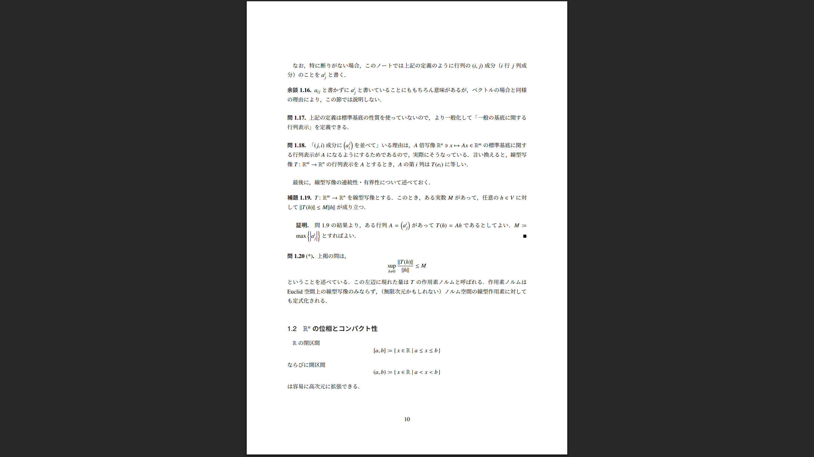
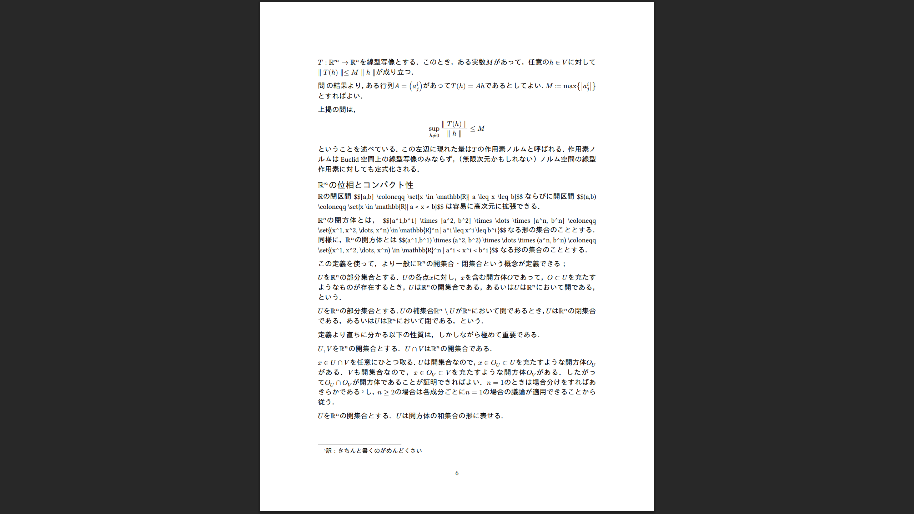

# LaTeX から typst に移行したときのメモ

## 移行対象

https://github.com/xenolay/calculus_on_manifolds

- だいたい4000行くらいの `.tex` ファイル群
- ふつうの数学のノート

## 下準備

- typst のコードをある程度弄る必要があるので執筆環境はあったほうがいい。
  - typst cli がほしければ cargo install で一発
    - https://github.com/typst/typst?tab=readme-ov-file#installation にあるように `cargo install --locked typst-cli` すればいい
  - VSC の拡張機能 tinymist typst がある。
    - https://github.com/Myriad-Dreamin/tinymist
    - preview 機能があり、ホットリロードしてくれる。便利。
      - LaTeX にもホットリロードしてくれるような仕組みはなにかしらあるとは思う。私が LaTeX を使ってた頃は TeXShop とかいうメモ帳を使っていて、毎回手動でコンパイルしていたのでよくわかんないんですが……
    - 

## とりあえず `.typ` ファイルをコンパイルするところまで

- とりあえず pandoc を使って latex のコードを typst に無理くり変換する
  - pandoc は https://github.com/jgm/pandoc/blob/main/INSTALL.md にやりかたがのってる


```bash
# 変換下ごしらえ（叩き台用ディレクトリ）
mkdir -p draft
cd draft
# ルート＆分割ファイルを個別に .typ に変換（失敗しても続行）
pandoc -f latex -t typst -s Calculus_on_Manifolds.tex \
  --resource-path=. -o draft/main.typ
```

こうやってみたところ main.typ に4000行くらいの typ ファイルが生成された。

もともとの Calculus_on_Manifolds.tex は以下のような感じで section 単位で tex ファイルを分割していたのだが、どうも pandoc は include 文の内容をベタに展開して変換する様子。

```tex
\documentclass[uplatex,11pt,a4]{jsarticle}

\include{./preamble.tex}

\begin{document}
\title{多変数の解析学}
\author{}
\date{}
\maketitle

\newpage

\include{./preface.tex}

\include{./acknowledgement.tex}

\newpage

\tableofcontents

\newpage

\include{./section1.tex}

\newpage

\include{./section2.tex}

\newpage

\include{./section3.tex}

\newpage

\include{./section4.tex}

\newpage

\include{./section5.tex}

\newpage

\include{./section6.tex}

\end{document}
```

当然ながらそのままだとあちこちメチャクチャになっており、動かない。ので、LaTeX の section 単位で分割して移行する方針にする。

とりあえず、本文をすべてコメントアウトしてコンパイルが通ることを確認する。→できた。

## pandoc が変換してくれなかったと明示的に申告してきたもの

この時点で pandoc が出した警告も確認しておくと、以下のようなものがたくさんでていた。

```
  unexpected control sequence \set
  expecting "%", "\\label", "\\tag", "\\nonumber", whitespace or "\\allowbreak"
[WARNING] Could not convert TeX math \set{x}, rendering as TeX:
  \set{x}
      ^
```

記憶が正しければ私は braket パッケージで宣言されている `\set` コマンドを使って集合を書いていたはず。 https://www.ctan.org/pkg/braket
さすがに外部パッケージのコマンドまでいい感じに解決はしてくれないか。

## pandoc 任せで全部うまく行ったもの

逆に、自分が定義した preamble であればある程度は pandoc で勝手に解決してくれるように見える。私はあんまり凝ったことを preamble でやっていなかったので苦労せずに済んだのかも。

TeX 側で

```tex
\newcommand{\Real}{\mathbb{R}}
```

のように定義したうえで

```tex
特に，$M$として$\Real$の閉区間$[a,b]$，$\omega$として$[a,b]$上の0-形式（すなわち$C^\infty$級関数）$F$を取り，$F$の導関数を$f$と書くことにすれば，...
```

と書いていたものが、pandoc に通した段階で

```typ
特に，$M$として$bb(R)$の閉区間$\[ a \, b \]$，$omega$として$\[ a \, b \]$上の0-形式（すなわち$C^oo$級関数）$F$を取り，$F$の導関数を$f$と書くことにすれば，...
```

のように翻訳されていた。LaTeX の preamble で勝手に定義した `\Real` が typst の `$bb(R)` に変換されていることに注意。

## pandoc 任せだとちっともうまく行ってる様子がないもの

- 章の番号付けや定理番号
- フォント

がかなりうまく行ってない様子。

latex 


typst


とりあえず定理番号がちゃんとついてフォントがマトモになればそれっぽさが増すと思うのでそこを修復する。
